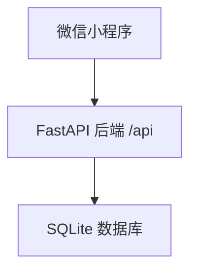
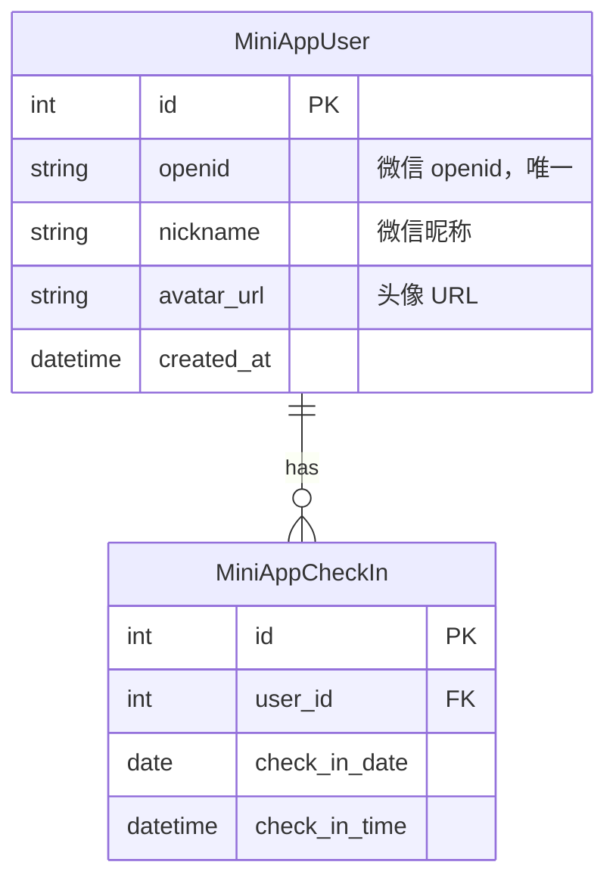

# 微信小程序每日签到 - 技术设计

Feature Name: miniapp-check-in
Updated: 2026-07-07

## 描述

一个微信小程序签到应用。用户通过微信授权登录后，每次打开小程序即自动完成当日签到打卡，支持查看签到日历、连续签到天数和历史记录。

## 架构



## 技术栈

| 层 | 技术 | 说明 |
|---|------|------|
| 前端 | 微信小程序原生 | 无需跨端框架，体积最小 |
| 后端 | Python 3 + FastAPI | 自动 API 文档、开发快 |
| 数据库 | SQLite | 纯签到场景，数据量小 |
| ORM | SQLAlchemy | FastAPI 标准搭配 |
| 认证 | 微信 OAuth | code 换 openid + JWT |

## 数据模型



### MiniAppUser

通过微信 openid 唯一标识的用户。首次登录时自动创建。

### MiniAppCheckIn

每日签到记录。`(user_id, check_in_date)` 联合唯一约束确保每日仅签到一次。通过查询签到记录来计算连续签到天数。

## 组件与接口

### 后端模块结构

```
backend/
├── main.py              # FastAPI 应用入口
├── config.py            # 配置
├── models/
│   └── models.py        # MiniAppUser, MiniAppCheckIn
├── routers/
│   └── api.py           # 登录 + 签到 + 记录
└── services/
    └── checkin.py       # 签到逻辑 + 连续天数计算
```

### API 接口

| 方法 | 路径 | 说明 |
|------|------|------|
| POST | `/api/auth/login` | 微信登录（code 换 JWT） |
| POST | `/api/checkin` | 执行签到 |
| GET | `/api/checkin/today` | 查询今日签到状态 |
| GET | `/api/checkin/calendar` | 签到日历（按月） |
| GET | `/api/records` | 签到记录列表 |

### 小程序页面结构

| 页面 | 路径 | 说明 |
|------|------|------|
| 首页 | pages/index/index | 签到状态、连续天数 |
| 签到日历 | pages/calendar/calendar | 月历视图 |
| 记录 | pages/records/records | 历史签到列表 |
| 我的 | pages/mine/mine | 用户信息、统计数据 |

### 连续签到计算

连续天数由后端根据签到记录实时计算，不存储为冗余字段：

```python
def calc_consecutive_days(user_id: int) -> int:
    records = get_records_desc(user_id)
    if not records or records[0].check_in_date < today():
        return 0
    count = 1
    for i in range(len(records) - 1):
        if records[i].check_in_date - records[i+1].check_in_date == 1 day:
            count += 1
        else:
            break
    return count
```

## 正确性约束

1. `(user_id, check_in_date)` 唯一约束确保每日仅签到一次。
2. 连续天数按实际签到日期连续计算，中断于任何未签到日。
3. 所有 API 请求须携带 JWT Token 并校验 openid。

## 错误处理

| 场景 | 策略 |
|------|------|
| 微信 code 换取 openid 失败 | 返回错误，提示重试 |
| 重复签到 | 返回"今日已签到" |
| 数据库写入失败 | 回滚事务，记录日志 |

## 测试策略

- **API 测试**：FastAPI TestClient 覆盖登录、签到、查询接口
- **单元测试**：连续天数计算逻辑、重复签到拦截
