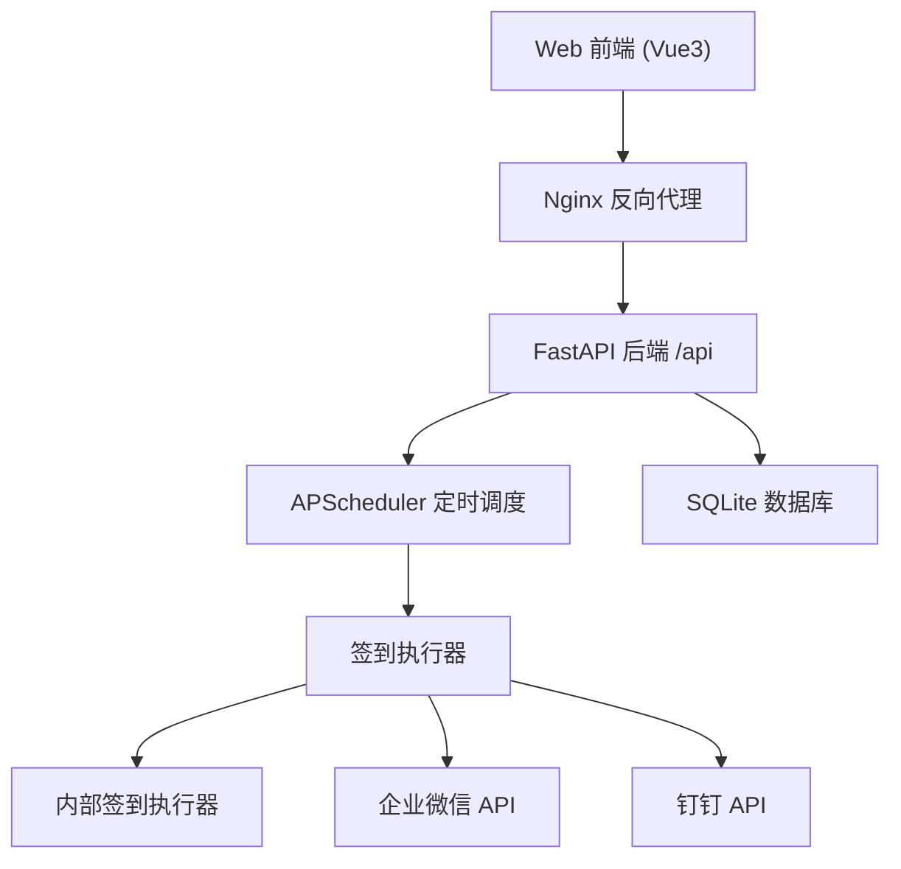
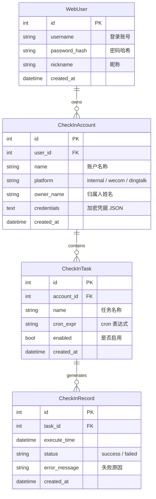

# Web 多账户定时签到系统 - 技术设计

Feature Name: scheduled-check-in
Updated: 2026-07-07

## 描述

Web 端多账户自动签到系统。用户通过网页登录后管理多个签到目标账户，支持内部签到和第三方平台（企业微信、钉钉）对接，配置定时任务后系统自动执行签到。

## 架构



## 技术栈

| 层 | 技术 | 说明 |
|---|------|------|
| 前端 | Vue 3 + Vite | 轻量、组件化、生态成熟 |
| 后端 | Python 3 + FastAPI | 自动 API 文档、异步支持 |
| 数据库 | SQLite | 小团队够用，零配置 |
| 定时任务 | APScheduler | 内嵌式调度，无需额外中间件 |
| ORM | SQLAlchemy | FastAPI 标配 |
| 认证 | JWT | 账号密码登录 |

## 数据模型



### WebUser

通过账号密码登录的用户。一个用户可管理多个签到账户。

### CheckInAccount

用户绑定的签到目标账户。`platform` 决定使用哪个执行器（internal / wecom / dingtalk）。`owner_name` 记录该账户的实际归属人，`credentials` 使用 AES 加密存储。

### CheckInTask

签到任务定义。`cron_expr` 由 APScheduler 解析调度。`enabled` 控制任务开关。

### CheckInRecord

签到执行记录，关联到 CheckInTask。按任务维度统计。

## 组件与接口

### 后端模块结构

```
backend/
├── main.py              # FastAPI 应用入口
├── config.py            # 配置管理
├── models/
│   └── models.py        # SQLAlchemy 数据模型
├── routers/
│   ├── auth.py          # 注册/登录
│   ├── accounts.py      # 签到账户 CRUD
│   ├── tasks.py         # 签到任务 CRUD
│   └── records.py       # 签到记录查询
├── services/
│   ├── scheduler.py     # APScheduler 调度管理
│   └── executors/
│       ├── base.py      # 执行器基类
│       ├── internal.py  # 内部签到
│       ├── wecom.py     # 企业微信
│       └── dingtalk.py  # 钉钉
└── utils/
    ├── auth.py          # JWT 工具
    └── crypto.py        # 凭据加密
```

### API 接口

#### 认证

| 方法 | 路径 | 说明 |
|------|------|------|
| POST | `/api/auth/register` | 用户注册 |
| POST | `/api/auth/login` | 用户登录，返回 JWT |

#### 签到账户（需 JWT）

| 方法 | 路径 | 说明 |
|------|------|------|
| GET | `/api/accounts` | 账户列表 |
| POST | `/api/accounts` | 添加账户 |
| GET | `/api/accounts/{id}` | 账户详情 |
| PUT | `/api/accounts/{id}` | 编辑账户 |
| DELETE | `/api/accounts/{id}` | 删除账户（级联删除任务） |
| POST | `/api/accounts/{id}/auth` | 触发第三方 OAuth |
| GET | `/api/accounts/{id}/auth/callback` | OAuth 回调 |

#### 签到任务（需 JWT）

| 方法 | 路径 | 说明 |
|------|------|------|
| GET | `/api/accounts/{id}/tasks` | 任务列表 |
| POST | `/api/accounts/{id}/tasks` | 创建任务 |
| GET | `/api/tasks/{id}` | 任务详情 |
| PUT | `/api/tasks/{id}` | 编辑任务 |
| DELETE | `/api/tasks/{id}` | 删除任务 |

#### 签到记录（需 JWT）

| 方法 | 路径 | 说明 |
|------|------|------|
| GET | `/api/records` | 记录列表，支持筛选 |
| GET | `/api/records/stats` | 签到统计 |
| GET | `/api/tasks/{id}/records` | 某任务记录 |

### 签到执行器设计

```python
class BaseExecutor:
    async def execute(self, account: CheckInAccount) -> CheckInResult:
        raise NotImplementedError

def get_executor(platform: str) -> BaseExecutor:
    executors = {
        "internal": InternalExecutor(),
        "wecom": WeComExecutor(),
        "dingtalk": DingTalkExecutor(),
    }
    return executors[platform]
```

### 定时调度设计

APScheduler `BackgroundScheduler` 嵌入 FastAPI 进程：

- 应用启动时加载所有启用的 CheckInTask，注册 Job
- 任务增删改时动态增改移调度 Job
- Job 触发流程：调用执行器 → 写入 CheckInRecord → 失败自动重试一次

```python
def register_task(task: CheckInTask):
    scheduler.add_job(
        func=execute_check_in,
        trigger=CronTrigger.from_crontab(task.cron_expr),
        args=[task.id],
        id=f"task_{task.id}",
        replace_existing=True,
    )
```

## 正确性约束

1. 同一 CheckInTask 在同一时间窗口内最多执行一次成功签到。
2. 先调用 API 成功后再写入 CheckInRecord。
3. 删除 CheckInAccount 时级联删除 CheckInTask 和 CheckInRecord。
4. 所有查询须基于 JWT 中的 user_id 过滤。

## 错误处理

| 场景 | 策略 |
|------|------|
| 第三方 API 超时 | 重试 1 次，仍失败标记失败 |
| 第三方授权过期 | 标记失败，通知用户重新授权 |
| 数据库写入失败 | 回滚事务，记录日志 |
| 定时任务异常 | 捕获异常，写入失败记录 |
| JWT 过期 | 返回 401，前端跳转登录页 |

## 测试策略

- **单元测试**：执行器逻辑、调度器、加密工具
- **API 测试**：FastAPI TestClient 覆盖所有接口
- **集成测试**：创建账户 → 创建任务 → 定时触发 → 验证记录

## 前端路由

| 路由 | 页面 | 说明 |
|------|------|------|
| `/login` | 登录页 | 账号密码登录 |
| `/register` | 注册页 | 新用户注册 |
| `/dashboard` | 仪表盘 | 账户总览 + 今日统计 |
| `/accounts` | 账户列表 | 已绑定账户 |
| `/accounts/:id` | 账户详情 | 账户信息 + 任务列表 |
| `/accounts/:id/tasks/new` | 新建任务 | 任务表单 |
| `/accounts/:id/tasks/:tid` | 任务详情 | 任务编辑 |
| `/records` | 签到记录 | 历史记录 + 筛选 |
