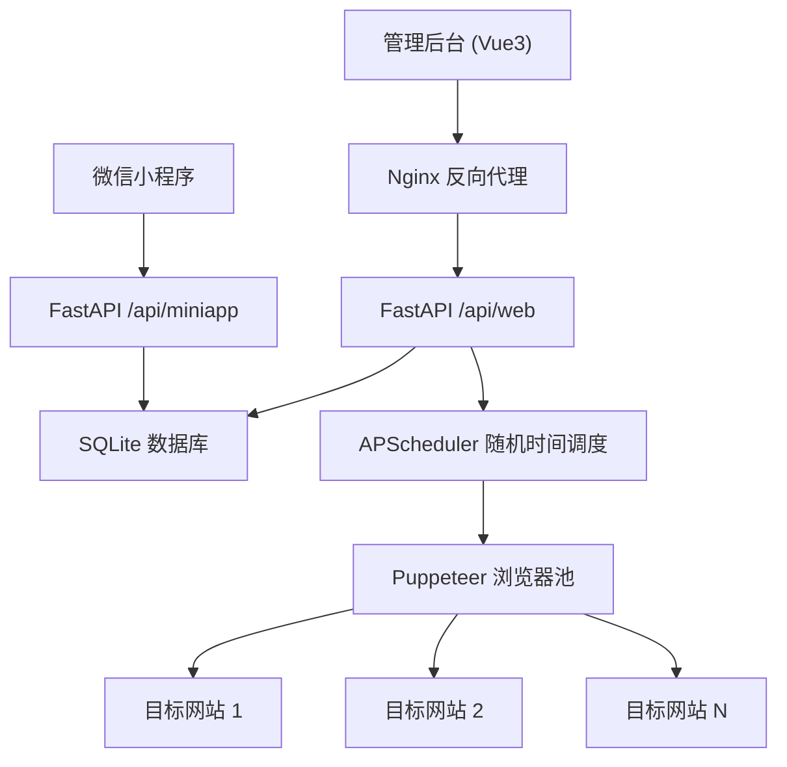
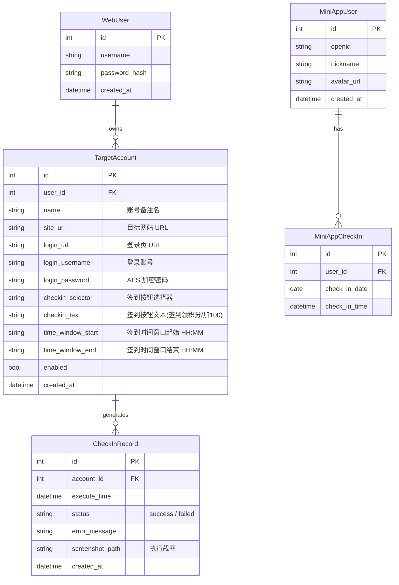

# 统一签到系统 - 技术设计（修订版）

Feature Name: unified-check-in
Updated: 2026-07-07

## 描述

统一项目支撑两个签到场景：Web 端使用 Puppeteer + stealth 反检测技术模拟浏览器完成目标网站签到；小程序端提供每日登录签到。共用 FastAPI 后端和 SQLite 数据库。

## 架构



## 技术栈

| 层 | 技术 | 说明 |
|---|------|------|
| 管理后台 | Vue 3 + Vite | 账号管理、签到记录查看 |
| 小程序 | 微信小程序原生 | 签到 + 日历 |
| 后端 | Python 3 + FastAPI | API 服务 |
| 浏览器自动化 | Puppeteer (Node.js) | 通过 subprocess 由 Python 调用 |
| 反检测 | puppeteer-extra + stealth 插件 | 隐藏 webdriver 等自动化特征 |
| 数据库 | SQLite | 账号、任务、记录存储 |
| 定时调度 | APScheduler | 随机时间触发 |

## 为什么选 Puppeteer + stealth？

| 方案 | 反检测能力 | 维护状态 |
|------|-----------|---------|
| Puppeteer + stealth | 最强，社区首选 | 活跃 |
| Playwright + stealth | 较强 | 插件更新较慢 |
| Selenium + undetected-chromedriver | 中等 | 依赖 chromedriver 版本匹配 |

`puppeteer-extra-plugin-stealth` 抹除了 `navigator.webdriver`、`chrome.runtime` 等数十项自动化指纹，配合行为模拟后几乎无法被通用检测脚本识别。

## Web 自动化签到流程

```
1. 启动 Puppeteer 浏览器实例（应用 stealth 插件）
2. 设置随机视口、随机 UA
3. 打开目标网站登录页
4. 模拟人类输入账号（随机间隔 50~250ms/字符）
5. 模拟人类输入密码
6. 随机延迟 300~1500ms
7. 模拟鼠标移动到登录按钮（贝塞尔曲线）
8. 随机微移后点击
9. 等待页面加载（随机 1~5s）
10. 定位签到按钮（文本/选择器匹配）
11. 如果需要滚动，模拟人类滚动（分段、随机速度）
12. 贝塞尔曲线移动鼠标到签到按钮
13. 点击签到
14. 等待结果，截图保存
15. 关闭浏览器
```

## 反检测策略清单

```python
RANDOM_CONFIG = {
    "viewport": random.choice([
        {"width": 1920, "height": 1080},
        {"width": 1366, "height": 768},
        {"width": 1536, "height": 864},
        {"width": 1440, "height": 900},
    ]),
    "user_agent": random.choice(REAL_UA_LIST),
    "typing_delay": (50, 250),       # ms per char
    "click_delay": (300, 2000),      # ms before click
    "scroll_speed": (100, 500),      # ms per step
    "page_wait": (1000, 5000),       # ms after page load
    "click_offset": (-5, 5),         # px random offset
    "mouse_steps": (20, 40),         # bezier curve steps
}
```

### 防检测层级

| 层级 | 技术 | 效果 |
|------|------|------|
| 指纹层 | stealth 插件 | 抹除 webdriver、插件列表等特征 |
| 网络层 | 随机 UA、语言、时区 | 模拟真实浏览器环境 |
| 行为层 | 贝塞尔鼠标、随机间隔、打字模拟 | 消除固定操作模式 |
| 时间层 | 每天随机时间触发 | 消除定时规律 |

## 数据模型



## 后端模块结构

```
backend/
├── main.py                 # FastAPI 入口
├── config.py               # 配置
├── database.py
├── models/
│   ├── web.py              # WebUser, TargetAccount, CheckInRecord
│   └── miniapp.py          # MiniAppUser, MiniAppCheckIn
├── routers/
│   ├── web_auth.py         # 管理后台认证
│   ├── web_accounts.py     # 目标网站账号 CRUD
│   ├── web_records.py      # 签到记录
│   └── miniapp.py          # 小程序 API
├── services/
│   ├── scheduler.py        # APScheduler 随机时间调度
│   ├── browser_worker.py   # 调用 Node.js Puppeteer 脚本
│   └── checkin.py          # 小程序签到逻辑
├── scripts/
│   └── checkin.js          # Puppeteer 签到脚本（Node.js）
└── utils/
    ├── auth.py             # JWT
    └── crypto.py           # AES 加密
```

### browser_worker.py 设计

Python 通过 subprocess 调用 Node.js Puppeteer 脚本，传入 JSON 参数：

```python
async def execute_checkin(account: TargetAccount) -> dict:
    config = generate_random_config()  # 随机化所有行为参数
    result = subprocess.run(
        ["node", "scripts/checkin.js"],
        input=json.dumps({
            "login_url": account.login_url,
            "username": decrypt(account.login_username),
            "password": decrypt(account.login_password),
            "checkin_selector": account.checkin_selector,
            "checkin_text": account.checkin_text,
            "random_config": config,
        }),
        capture_output=True, text=True, timeout=120
    )
    return json.loads(result.stdout)
```

### checkin.js 核心逻辑

```javascript
const puppeteer = require('puppeteer-extra');
const StealthPlugin = require('puppeteer-extra-plugin-stealth');
puppeteer.use(StealthPlugin());

// 接收 Python 传入的参数
const params = JSON.parse(process.stdin.read());

async function run() {
  const browser = await puppeteer.launch({
    headless: 'new',
    args: ['--no-sandbox', '--disable-setuid-sandbox']
  });
  const page = await browser.newPage();

  // 设置随机视口和 UA
  await page.setViewport(params.random_config.viewport);
  await page.setUserAgent(params.random_config.user_agent);

  // 打开登录页
  await page.goto(params.login_url, { waitUntil: 'networkidle2' });

  // 输入账号（模拟人类打字）
  await typeHumanLike(page, '#username', params.username);

  // 输入密码
  await typeHumanLike(page, '#password', params.password);

  // 点击登录（贝塞尔曲线 + 随机偏移）
  await clickHumanLike(page, 'button[type="submit"]');

  // 等待页面加载
  await sleep(random(1000, 5000));

  // 定位签到按钮并点击
  await clickHumanLike(page, params.checkin_selector);

  // 截图保存
  const screenshot = await page.screenshot({ encoding: 'base64' });

  await browser.close();
  return { status: 'success', screenshot };
}
```

## 随机时间调度

APScheduler 每天在用户配置的时间窗口内随机选取时刻，同一用户的多个账号时间互斥：

```python
import random

def schedule_all_accounts(user_id: int):
    accounts = get_enabled_accounts(user_id)
    # 获取窗口内的所有分钟数
    start_min = 6 * 60   # 06:00
    end_min = 22 * 60    # 22:00
    pool = list(range(start_min, end_min))

    # 无放回随机抽样，每个账号分到一个不重复的时刻
    chosen = random.sample(pool, len(accounts))

    for account, minute in zip(accounts, chosen):
        h, m = minute // 60, minute % 60
        scheduler.add_job(
            func=execute_checkin,
            trigger=CronTrigger(hour=h, minute=m),
            args=[account.id],
            id=f"checkin_{account.id}",
            replace_existing=True,
        )
```

每天重新调度时重新随机，保证长期来看无固定规律。

## API 接口

### 管理后台

| 方法 | 路径 | 说明 |
|------|------|------|
| POST | `/api/web/auth/register` | 注册 |
| POST | `/api/web/auth/login` | 登录 JWT |
| GET | `/api/web/accounts` | 目标账号列表 |
| POST | `/api/web/accounts` | 添加目标账号 |
| PUT | `/api/web/accounts/{id}` | 编辑账号 |
| DELETE | `/api/web/accounts/{id}` | 删除账号 |
| POST | `/api/web/accounts/{id}/run` | 手动立即执行签到 |
| GET | `/api/web/records` | 签到记录 |

### 小程序

| 方法 | 路径 | 说明 |
|------|------|------|
| POST | `/api/miniapp/auth/login` | 微信登录 |
| POST | `/api/miniapp/checkin` | 签到 |
| GET | `/api/miniapp/checkin/today` | 今日状态 |
| GET | `/api/miniapp/checkin/calendar` | 签到日历 |
| GET | `/api/miniapp/records` | 记录 |

## 正确性约束

1. 密码使用 AES-256-CBC 加密存储，密钥由环境变量注入。
2. 每天同一账号仅执行一次签到（调度层保证）。
3. 同一用户下各账号签到时间互不相同（random.sample 无放回抽样）。
4. 签到失败自动重试一次，间隔 5-30 分钟随机。
5. 浏览器实例执行完毕后强制关闭，防止进程泄漏。
6. Puppeteer 脚本超时 120 秒自动终止。

## 错误处理

| 场景 | 策略 |
|------|------|
| 登录失败 | 截图保存，标记失败，通知用户 |
| 签到按钮未找到 | 截图保存，记录选择器信息 |
| Puppeteer 超时 | 强杀进程，标记失败 |
| 目标网站不可达 | 重试一次，仍失败则跳过 |
| JWT 过期 | 返回 401 |
